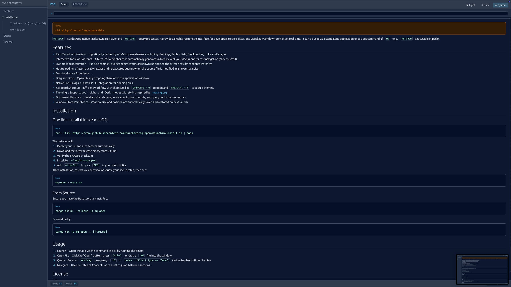

<h1 align="center">mq-open</h1>

`mq-open` is a desktop-native Markdown previewer and `mq-lang` query processor. it provides a highly responsive interface for developers to slice, filter, and visualize Markdown content in real-time.

It can be used as a standalone application or as a subcommand of `mq` (e.g., `mq-open` executable in path).



## Features

- **Rich Markdown Preview**: High-fidelity rendering of Markdown elements including Headings, Tables, Lists, Blockquotes, Links, and Images.
- **Interactive Table of Contents**: A hierarchical sidebar that automatically generates a tree-view of your document for fast navigation (click-to-scroll).
- **Live mq-lang Integration**: Execute complex queries against your Markdown file and see the filtered results rendered instantly.
- **Hot Reloading**: Automatically reloads and re-executes queries when the source file is modified in an external editor.
- **Desktop-Native Experience**:
  - **Drag and Drop**: Open files by dropping them onto the application window.
  - **Native File Dialogs**: Seamless OS integration for opening files.
  - **Keyboard Shortcuts**: Efficient workflow with shortcuts like `Cmd/Ctrl + O` to open and `Cmd/Ctrl + T` to toggle themes.
- **Theming**: Supports both **Light** and **Dark** modes with styling inspired by [mqlang.org](https://mqlang.org).
- **Document Statistics**: Live status bar showing node counts, word counts, and query performance metrics.
- **Window State Persistence**: Window size and position are automatically saved and restored on next launch.

## Installation

### One-line Install (Linux / macOS)

```bash
curl -fsSL https://raw.githubusercontent.com/harehare/mq-open/main/bin/install.sh | bash
```

The installer will:
1. Detect your OS and architecture automatically
2. Download the latest release binary from GitHub
3. Verify the SHA256 checksum
4. Install to `~/.local/bin/mq-open`
5. Add `~/.local/bin` to your `PATH` in your shell profile

After installation, restart your terminal or source your shell profile, then run:

```bash
mq-open --version
```

### From Source

Ensure you have the Rust toolchain installed.

```bash
cargo build --release -p mq-open
```

Or run directly:

```bash
cargo run -p mq-open -- [file.md]
```

## Usage

1. **Launch**: Open the app via the command line or by running the binary.
2. **Open File**: Click the "Open" button, press `Ctrl+O`, or drag a `.md` file into the window.
3. **Query**: Enter an `mq-lang` query (e.g., `.h2` or `nodes | filter(.type == "Code")`) in the top bar to filter the view.
4. **Navigate**: Use the Table of Contents on the left to jump between sections.

## License

MIT
